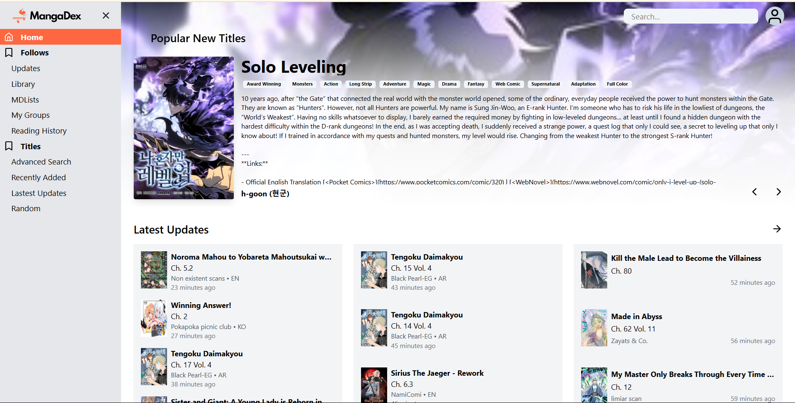

# mangadex-clone

## Description

**mangadex-clone** is a beginner-friendly React application designed to help you browse and read manga. Using the [MangaDex API](https://api.mangadex.org/), this project allows users to search for manga titles, view detailed information, and explore chapters.  
It features a clean and intuitive interface, making it easy for manga fans to find and enjoy their favorite series.
There will be the uploading chapter/manga soon.

---

## Key Features

- 🔍 **Search Functionality**: Find manga titles with search feature.
- 📖 **Manga Details**: View the information of manga, such as title, description, and cover images, author, genres.
- 📚 **Chapter Navigation**: Browse through available chapters for the selected manga.
- 📱 **Responsive Design**: Works smoothly on desktops and smartphones.

---

## Steps to Run

### 1. Create a new Vite project

```bash
npm create vite@latest
```

### 2. Navigate to the project directory

```bash
cd your-project-name
```

### 3. Install dependencies

```bash
npm install
```
### 4. Install additional packages

```bash
npm install axios
npm install swiper
npm install tailwindcss @tailwindcss/vite
```

### 5. Start the development server

```bash
npm run dev
```
Now, open your browser and go to http://localhost:5173/ to view the project.

---

## Screenshot

### Home Page



### Read Page


